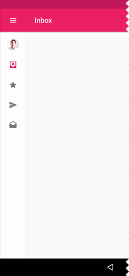
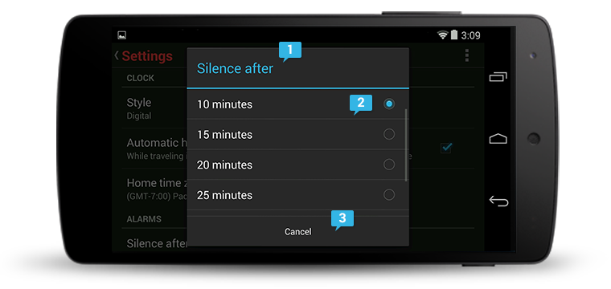
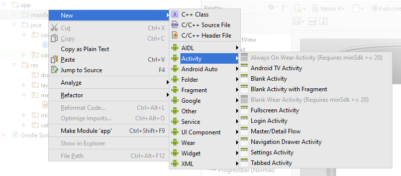
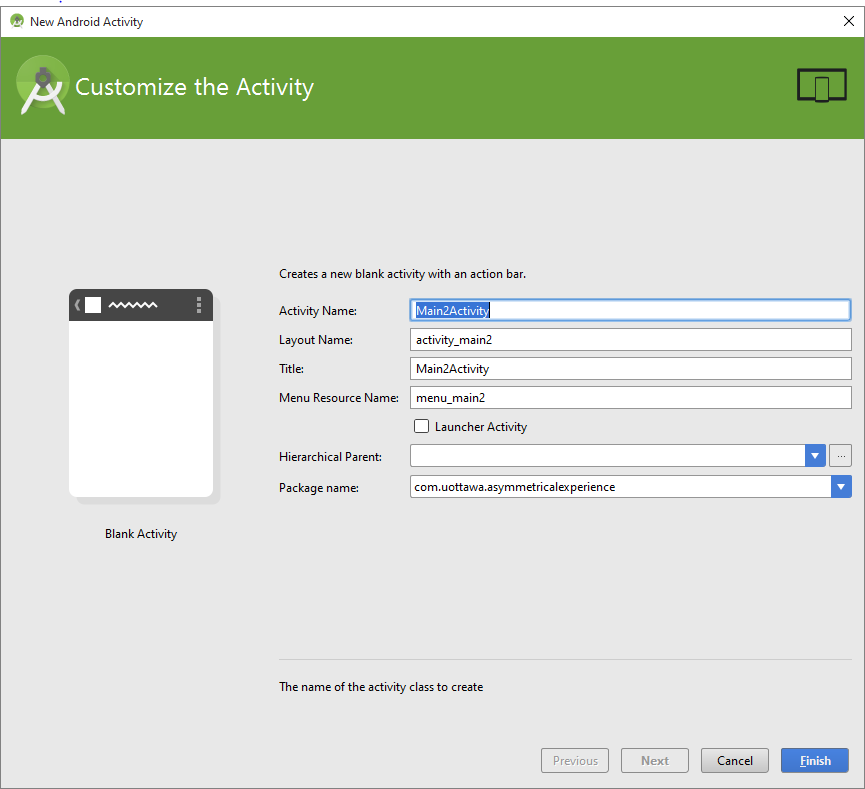
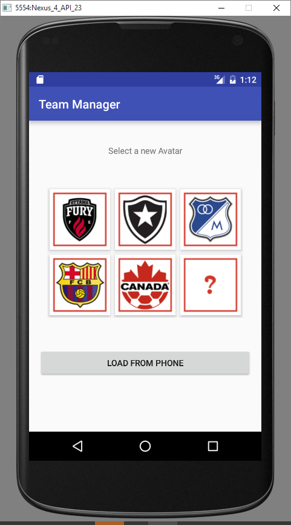

### Développement d'applications Android

Laboratoire Android 2 : Les menus, les interactions et les activités

<span style="color:gray"></span>

<span style="color:gray">SEG 2505 - Introduction au génie logiciel</span>

<span style="color:gray">Automne 2017</span>

<span style="color:gray">Présenté par : Cédric Clément</span>

---

### Plan

1. Éléments d'interfaces usagers
2. Les activités
3. Les intentions
4. Le transfert de données
5. Travail de laboratoire

<span style="font-size:0.6em;color:gray">Appuyez sur la clé <span style="color:#3884b9">**O**</span> pour voir un survole de la présentation.</span>

---

### Éléments d'interfaces usagers

+++

##### Menus et la barre d'action

- <span style="font-size:0.6em;color:gray">Android vous offre une variété d'éléments visuels</span>
    - <span style="font-size:0.6em;color:gray">options dans les <span style="color:#00aa60">menus</span></span>
    - <span style="font-size:0.6em;color:gray"><span style="color:#e8bf6a">barre</span> d'action</span>
    - <span style="font-size:0.6em;color:gray">menu contextuel ("long-click")</span>
    - <span style="font-size:0.6em;color:gray">"<span style="color:#3884b9">popup</span>"</span>
- <span style="font-size:0.6em;color:gray">définitions de ces éléments en <span style="color:#d0d0ff">XML</span></span>

Note:
- Menu "Popup" : les actions dans ces menus ne devraient pas avoir un impacte directe sur le contenu, mais plutôt pour les séries d'actions

+++

<span style="color:gray">La gestion de ces événements se fait avec des "<span style="color:#3884b9">Click Events</span>" comme <span style="color:white">`OnClick()`</span> ou avec un <span style="color:#c45331">Override</span> de <span style="color:white">`onOptionItemSelected()`</span>.</span>

+++

#### Les fragments

- <span style="font-size:0.6em;color:gray">représentente des <span style="color:#00aa60">portions</span> d'une interface</span>
- <span style="font-size:0.6em;color:gray">peuvent être <span style="color:#e8bf6a">combinés</span></span>
- <span style="font-size:0.6em;color:gray"><span style="color:#3884b9">modulaire</span></span>


Note:
- les Fragments sont utilisés pour représenter des portions d'une interface d'utilisateur
- plusieurs Fragments peuvent être combinés pour créer une interface
- les Fragments sont réutilisables et modulaires

+++

#### Tiroire de navigation

<span style="font-size:0.6em;color:gray">Panneau qui présente les <span style="color:#3884b9">fonctions de navigation</span> pour l'application.</span>

- <span style="font-size:0.6em;color:gray">Types:</span>
    1. <span style="font-size:0.6em;color:gray">**Permanent**: <span style="color:#a1617a">toujours présent</span></span>
    2. <span style="font-size:0.6em;color:gray">**Persistant**: ouvrir/fermer/basculer, <span style="color:#00aa60">déplace le contenu</span></span>
    3. <span style="font-size:0.6em;color:gray">**Temporaire**: ouvrir/fermer/basculer, <span style="color:#d0d0ff">masque le contenu</span></span>
    4. <span style="font-size:0.6em;color:gray">**Mini-Variable**: petit panneau avec des <span style="color:orange">icônes seulement</span>. Peut être utilisé dans l'état fermé.</span>

Note:
- C'est un panneau qui présente les fonctions de navigation pour l'application. Il y a 4 types:
1. Permanent: toujours présent
2. Persistant: ouvrir/fermer/basculer, déplace le contenu
3. Temporaire: ouvrir/fermer/basculer, masque le contenu
4. Mini-Variable: petit panneau avec des icônes seulement. Peut être utilisé dans l'état fermé.

+++



+++

#### Les dialogues

- <span style="font-size:0.6em;color:gray">invitent l'utilisateur à <span style="color:#e8bf6a">prendre une décision</span></span>
- <span style="font-size:0.6em;color:gray">types: `AlertDialog`, `DatePickerDialog`, `TimePickerDialog`, `Custom`</span>




Note:
- les dialogues invitent l'utilisateur à prendre/fournir une décision ou pour des informations supplémentaires avant que l'application peut continuer
- types de dialogues
- AlertDialog
- DatePickerDialog
- TimePickerDialog
- Custom Layout

+++

#### Les Toasts

- <span style="font-size:0.6em;color:gray">morceaux de texte qui fournissent des <span style="color:orange">informations simples</span></span>
- <span style="font-size:0.6em;color:gray">disparaissent <span style="color:#a1617a">automatiquement</span></span>


Note:
- des morceaux de texte qui fournissent des informations simples
- disparaissent automatiquement après un montant de temps
- vous pouvez manipuler le positionnement

+++

#### Paramètres <span style="font-size:0.6em;color:gray">(Settings)</span>

<span style="color:gray">Permettent aux utilisateurs de <span style="color:#00aa60">modifier le fonctionnement</span> et le comportement d'une application.</span>
<br><br>
<span style="color:gray">Aide avec la construction d'<span style="color:#d0d0ff">interface uniforme</span> dans les applications Android.</span>

Note:
- Permettent aux utilisateurs de modifier le fonctionnement et le comportement d'une application (e.g : comment souvent faire une requête à la DB)
- Permettent la construction d'interface uniforme dans les applications Android

+++


---

### Les activités

- Les activités sont des composantes d'application qui permettent aux utilisateurs de faire une chose telle que d'entrer un numéro de téléphone, envoyer une photo, envoyer un message, visualiser une carte...
- Une application a typiquement plusieurs activités, une étant l'activité principale (MainActivity)
- Les activités individuelles ont leurs propres tâches. Ces activités sont liées ensemble avec des Intents.
- Lorsqu'une activité débute, l'activité antérieure est arrêtée et préservée dans le Stack
- Il n'y a pas de Main(). Les activités commencent à partir de leur méthode OnCreate().


Note:
- Les activités sont des composantes d'application qui permettent aux utilisateurs de faire une chose telle que d'entrer un numéro de téléphone, envoyer une photo, envoyer un message, visualiser une carte...
- Une application a typiquement plusieurs activités, une étant l'activité principale (MainActivity)
- Les activités individuelles ont leurs propres tâches. Ces activités sont liées ensemble avec des Intents.
- Lorsqu'une activité débute, l'activité antérieure est arrêtée et préservée dans le Stack
- Il n'y a pas de Main(). Les activités commencent à partir de leur méthode OnCreate().

+++

Commencer une nouvelle activité

- Les activités peuvent être appelées avec les fonctions suivantes:
- startActivity(Intent i)
- remarque: chaque activité à besoin d'un Intent
- les Intents peuvent être des morceaux d'applications ou des applications entières
- startActivityForResult(Intent i, RequestCode c)


---

### Les intentions

- Ce sont des objets messagers conçus pour envoyer la requête d'actions à des composantes
- Cas d'utilisation d'un Intent
- commencer une activité
- commencer un service
- livrer un message global (broadcast)
- Types: implicite, explicite


+++

- les Intents contiennent :
- nom d'une composante
- une action
- des informations (data)
- une catégorie
- des surplus (Extra)
- des drapeaux

[intents-filters](http://developer.android.com/guide/components/intents-filters.html)

---

### Travail de laboratoire
+++

Todo

Vous devez créer un gestionnaire d'équipe sportive. Ce gestionnaire devra gérer les joueurs d'une équipe et plusieurs équipe.

1. L'aplication doit:
    2.1 avoir plusieurs activités
    2.3 permettre l'utilisateur de créer le nom d'un profile
    2.4 permettre l'utilisateur de changer le nom d'un profile
    2.5 permettre l'utilisateur d'ajouter l'image d'un profile
    2.6 permettre l'utilisateur de changer l'image d'un profile
    2.7 permettre l'utilisateur d'ajouter une adresse un profile
    2.8 permettre l'utilisateur de modifier l'adresse d'un profile
    2.9 permettre l'utilisateur d'ouvrir une adresse dans une application de carte (eg. Google Maps)
    
+++

Activitée principale : vue du profil

- créez un nouveau projet avec une activité vide
- ajoutez un champ EditText pour le champ Personne/Équipe
- ajoutez un champ TextView pour accompagner le champ EditText
- définissez la valeur de la propriété "hint" du EditText à "Veuillez ajouter un nom"
- répétez ce processus pour le champ lieu (Location)
- ajoutez une vue d'image ImageView pour représenter l'image de l'équipe
- l'image sera initialement invisible, car aucune image ne sera assignée au champ et la valeur de la propriété "size" ne sera pas définie
- changez les propriétés de "width" et "height" à "100dp". Ceci rendra la boîte à 'image visible.
- ajoutez un bouton qui servira à ouvrir la carte
- La valeur du OnClick sera OnOpenInGoogleMaps (tantôt)

+++

Changer les images

- pour des médias (image, son, etc.) à votre projet vous avez qu'à placer les fichiers dans le répertoire "drawable"
- app > res > drawable
- right-click > "show in explorer"
- changez l'image défaut
- http://www.firasoft.com.br/UOT/avatars.zip
- http://www.firasoft.com.br/UOT/logos.zip


+++


+++

Intent explicite et activité externe

- ajoutez la prochaine méthode à votre activité principale (MainActivity.java)
- changez la propriété OnClick
- cette fonction fait une demande explicite au paquet de Google Maps

Notez que vous devez avoir le cadriciel de Google (Google API) dans votre émulateur virtuel pour que ceci fonctionne

```java
public void OnOpenInGoogleMaps (View view) {
    EditText teamAddres = (EditText) findViewById(R.id.teamAddressField);
    Uri gmmIntentUri = Uri.parse("http://maps.google.co.in/maps?q="+teamAddres.getText());
    Intent mapIntent = new Intent(Intent.ACTION_VIEW, gmmIntentUri);
    mapIntent.setPackage("com.google.android.apps.maps");
    startActivity(mapIntent);
}
```
@[2](Creating a return intent to pass to the Main Activity)
@[3](Créer un objet URI (URL) à partir de l'adresse)
@[4](Créer l'intention (Intent))
@[5](Déclarer l'intention comme explicite)
@[6](Commencer l'activité)


+++

Intent explicite et activité interne

- ajoutez la prochaine fonction à votre activité principale (MainActivity.java)
- changez la propriété OnClick de votre ImageView
- ceci va ouvrir une autre activité où nous allons choisir une nouvelle image pour l'équipe

```java
public void OnSetAvatarButton(View view) {
    Intent intent = new Intent(getApplicationContext(), ProfileActivity.class);
    startActivityForResult (intent,0);
}
```
<!-- @[2](https://developer.android.com/reference/android/content/Intent.html) -->
<!-- @[3](https://developer.android.com/training/basics/intents/result.html) -->


+++

- Le constructeur de l'objet Intent a deux paramètres
1. le contexte d'application (Application Context) : c'est d'où arrive l'application
1.1 Lorsque vous créez une nouvelle activité, une hiérarchie est créée et la nouvelle activité a comme parent l'activité qui a fait appelle à sa création
- vous passez `this` comme contexte,
- autrement, utilisez `getApplicationContext()` pour obtenir le contexte de l'application
2. classe Intent : c'est la classe pour laquel le Intent fait demande

+++

Statut présent

- votre application devra être similaire à ce que vous voyez ici
- ajoutez à la propriété `OnClick` une valeur de `OnOpenInGoogleMaps`
- ajoutez à la propriété `OnClick` du ViewImage le nom d'une fonction sur une autre diapositive
    - cette fonction va ouvrir la sélection de logo d'équipe


+++

Créer une nouvelle activité

Pour créer une nouvelle activité avec Android Studio, "right-click" et sélectionnez `New > Activity > Blank Activity`




+++

Créer une nouvelle activité (cont.)

- ajoutez les informations de votre choix et appuyez sur "Finish"
- lorsque vous créez une activité, Android Studio crée un nouveau fichier Java ainsi qu'un fichier XML pour l'interface d'utilisateur

+++

Parent hiérarchique
Si votre application implémente la fonctionnalité "UP", vous pouvez déclarer une autre activité comme le parent d'une autre

Exemple de fonctionnalité "UP"




---

Deuxième activité

- créez une deuxième activité qui est l'enfant de votre activité principale (MainActivity). Ceci se fait dans la boite de création.
- supprimez ce qui se trouve sur l'écran et ajoutez un VerticalLayout
- ajoutez un GridLayout au VerticalLayout et créez 6 nouveaux ImageViews à l'intérieur du VerticalLayout
- ajoutez un bouton au VerticalLayout sous le GridLayout

+++

- Comment puis-je retourner à l'activité principale ?
- Les activités sont structurées en pile. Une activité qui termine est "pop-é" de la pile et l'activité principale est rappelée. Notez que les champs locaux (dans les activités parentes) qui contiennent des informations ne les perdent pas lorsqu'une activité enfant est "pop-é".
- Lorsqu'on pop une activité, un tue l'instance
- Vous n'avez pas besoin de créer de bouton retour / “back”, Android fait ceci pour vous

+++

Retour à l'activité principale

- ajoutez la prochaine fonction à votre deuxième fichier d'activité
- ceci devrait être la méthode OnClick sur vos images
- le code envoie les ID des images qui ont été appuyées

```java
public void setTeamIcon(View view){
    Intent returnIntent = new Intent();
    ImageView selectedImage = (ImageView) view;
    returnIntent.putExtra("imageID", selectedImage.getId());
    setResult(RESULT_OK, returnIntent);
    finish();
}

```
@[2](Créer l'intention pour retourner les informations à `MainActivity`)
@[3](Obtenir l'information de l'image sélectionnée)
@[4-5](Ajouter les informations à l'intention créée sur la ligne 2)
@[6](Envoyer l'intention)


+++

Statut présent (2)

- votre application devra être similaire à ce que vous voyez ici
- ajoutez à la propriété OnClick de chaque icône la valeur de "SetTeamIconOnClick"
    - chaque image peut être liée à la fonction sur la prochaine diapositive




+++

Gérer les résultats

- Ajoutez cette méthode dans votre activité principale `MainActivity`. Cette méthode manipule les informations qui lui sont retournées dans le "Return Intent".
- Les informations passées dans le "Return Intent" sont interprétées et utilisées pour choisir la nouvelle image.
- Les noms des photos devraient être différents

```java
@Override
protected void onActivityResult(int requestCode, int resultCode, Intent data) {
    if (resultCode == RESULT_CANCELED) return;
    ImageView avatarImage = (ImageView) findViewById(R.id.avatarImage);
    
    String drawableName = "ic_logo_00"; //4
    switch (data.getIntExtra("imageID",R.id.teamid00)) {//Figuring out the correct image
        case R.id.teamid00:
            drawableName = "ic_logo_00";
            break;
        case R.id.teamid01:
            drawableName = "ic_logo_01";
            break;
        case R.id.teamid02:
            drawableName = "ic_logo_02";
            break;
        case R.id.teamid03:
            drawableName = "ic_logo_03";
            break;
        case R.id.teamid04:
            drawableName = "ic_logo_04";
            break;
        case R.id.teamid05:
            drawableName = "ic_logo_05";
            break;
        default:
            drawableName = "ic_logo_00";
            break;
    } //27
    int resID = getResources().getIdentifier(drawableName, "drawable",  getPackageName());
    avatarImage.setImageResource(resID);
}

```
@[2](Obtenir l'image que nous allons montrer à l'utilisateur)
@[4-27](Obtenir le nom de l'image)
@[28-29]()

+++

Statut présent (3)

- Votre application devrait:
    - montrer et pouvoir mettre à jour les noms d'équipe ainsi que les adresses
    - monter les adresses sur Google Maps
    - pouvoir mettre à jour les images d'équipe à partir d'une liste prédéfinie d'images
- Votre application ne devrait pas encore:
    - charger les images à partir d'images existantes sur le système (optionnel)

Notez que charger les images à partir d'images existantes sur le système porte quelques contraintes:
1. des permissions sont requises
2. des fichiers "manifest" doivent être gérés

---

Intentions implicites (Implicit Intents) [1]

- fonctionnalité de la caméra avec intention implicite:

`Intent i = new Intent(MediaStore.ACTION_IMAGE_CAPTURE);`

- peut ajouter des méta-informations (“Metadata”)
- `onActivityResult` reçoit un hyperlien à une image et décodera l'image

+++

```java
String dateExtension = new Date().getTime() + ".png";
File file = new File(Environment.getExternalStorageDirectory() + "/DCIM", "image" + dateExtension);
Uri imgUri = Uri.formFile(file);
String imgPath = file.getAbsolutePath();
final Intent intent = new Intent(MediaStore.ACTION_IMAGE_CAPTURE);
intent.putExtra(MediaStore.EXTRA_OUTPUT, setImageUri());
startActivityForResult(intent, CAPTURE_IMAGE);

// ... votre code ...

@Override
protected void onActivityResult(int requestCode, int resultCode, Intent data){
    if(resultCode != Activity.RESULT_CANCELLED){
        if(requestCode == CAPTURE_IMAGE){
            ImageView imageView = (ImageView) findViewById(R.id.imgView);
            imageView.setImageBitmap(BitmapFactory.decodeFile(imgPath));
        }
    }
}
```
<!-- @[2](Obtenir l'image que nous allons montrer à l'utilisateur) -->
<!-- @[4-27](Obtenir le nom de l'image) -->
<!-- @[28-29]() -->

---

Intentions implicites (Implicit Intents) [2]


- fonctionnalité pour sauvegarder des informations

`Intent i = new Intent(Intent.ACTION_PICK);`

- peut ajouter des méta-informations (Metadata)
- `onActivityResult` reçoit un hyperlien à un fichier et décodera le fichier

+++

```java
Intent i = new Intent(Intent.ACTION_PICK,android.provider.MediaStore.Images.Media.EXTERNAL_CONTENT_URI); startActivityForResult(i, RESULT_LOAD_IMAGE); 

// < ... votre code ... > 

@Override
protected void onActivityResult(int requestCode, int resultCode, Intent data) {
    super.onActivityResult(requestCode, resultCode, data);
    if (requestCode == RESULT_LOAD_IMAGE && resultCode == RESULT_OK && null != data) {
        Uri selectedImage = data.getData();
        String[] filePathColumn = { MediaStore.Images.Media.DATA };
        Cursor cursor = getContentResolver().query(selectedImage,filePathColumn, null, null, null);
        cursor.moveToFirst();
        int columnIndex = cursor.getColumnIndex(filePathColumn[0]);
        String picturePath = cursor.getString(columnIndex);
        cursor.close();
        ImageView imageView = (ImageView) findViewById(R.id.imgView);
        imageView.setImageBitmap(BitmapFactory.decodeFile(picturePath));
    }
}
```
<!-- @[2](Obtenir l'image que nous allons montrer à l'utilisateur) -->
<!-- @[4-27](Obtenir le nom de l'image) -->
<!-- @[28-29]() -->


---

- [Formation Android](https://developer.android.com/training/index.html)
- [Documentation Android](https://developer.android.com/index.html)